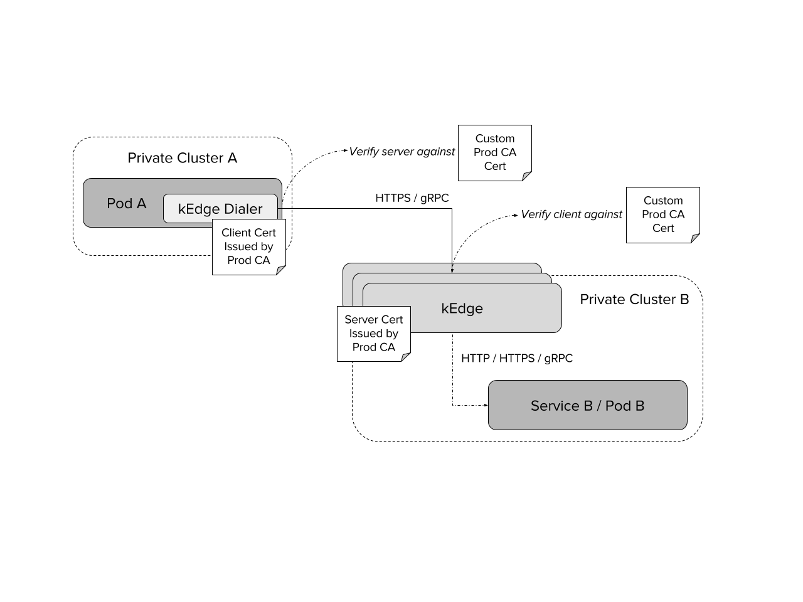
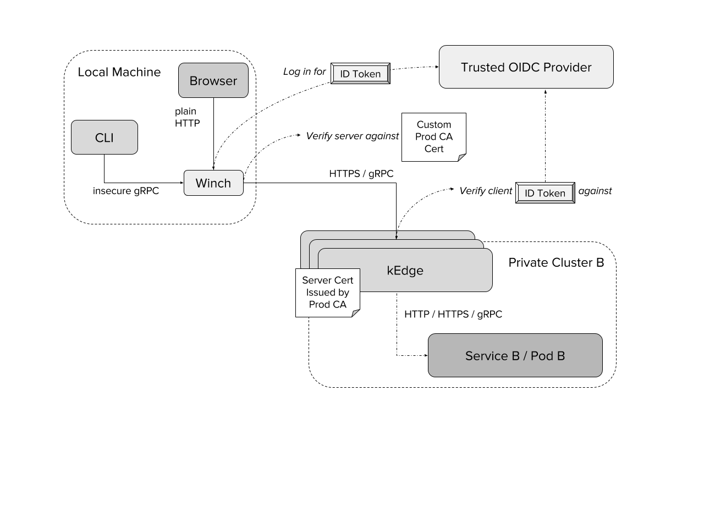

# :anchor: kedge - Kubernetes Edge Proxy

:warning: WARNING :warning: This project is planned to be deprecated in future. What does it mean? It is essentially used in production in many places, but there is plan to replace kedge with something based on envoy or linkerd, thus stop actively maintaining this project. Currently kEdge has still many advantages like OpenID Connect support, k8s resolver and adhoc & auto discovered backends routings, but we plan to migrate those to the new solution over time.

If you use kEdge and you would be affected, reach us via GH issue or slack! 

-----

 > [kedge](https://www.merriam-webster.com/dictionary/kedge) (verb) to move (a ship) by means of a line attached to a small anchor dropped at the distance and in the direction desired

Proxy for gRPC, HTTP (1.1/2) microservices with the aim to make cross-cluster
microservice communication simple to set up, and secure. All you need for it to work is: 
TLS client certificates in your service pods and special dialer, a single L4 load balanced IP address in each cluster, and a `kedge` server behind it.

## The pain of cross-cluster Kubernetes communication

Kubernetes is great, if you have one cluster. If you want to have two or more, you need more advanced configuration. 
This project stems from the frustration of setting up communication between two K8S clusters. This requires a couple of things:
 - cross-cluster networking - usually a complex process of setting up and maintaining IPSec bridges
 - configuration of routing rules - each cluster needs to know about each other cluster's 3 (!) network ranges: 
 host, pod and internal-service networks
 - providing federated service discovery - either through the alpha-grade 
 [K8S Federation](https://kubernetes.io/docs/concepts/cluster-administration/federation/) or [CoreDNS](https://github.com/coredns/coredns) stub zones

All these are subject to subtle interplays between routes, `iptables` rules, DNS packets and MTU limits of IPSec tunnels, 
which would make even a seasoned network engineer go gray.

At the same time, none of the existing service meshes or networking overlays provide an easy fix for this.

## Kedge Design

Kedge is a reverse/forward proxy for gRPC and HTTP traffic. 

It uses a concept of *backends* (see [gRPC](proto/kedge/config/grpc/backends/backend.proto), [HTTP](proto/kedge/config/http/backends/backend.proto)) 
that map onto K8S [`Services`](https://kubernetes.io/docs/user-guide/services/). These define load balancing policies, 
middleware used for calls, and resolution. The backends have "warm" connections ready to receive inbound requests.

The inbound requests are directed to *backends* based on *routes* (see [gRPC](proto/kedge/config/grpc/routes/routes.proto), 
[HTTP](proto/kedge/config/grpc/routes/routes.proto)). These match onto requests based on host, paths (services), headers (metadata). 
They also specify authorization requirements for the route to be taken.

Kedge can be accessed then: 

### Using native kedge http.Client inside caller library

Following diagram shows cross-cluster POD to POD communication using kEdge dialer.

### Using Winch (local proxy to kedges)

Following diagram shows the routing done by forward proxy called [winch (client)](docs/winch.md). In this example 
kedge OIDC auth is enabled to support corp use cases (per backend access controlled by permissions stored in custom IDToked claim). 
It can be also switched to just client certificate verification as in the diagram above.

NOTE: Any auth which is required by Service B / Pod B needs to configured on winch due to clients blocking sending auth headers via
 plain HTTP, even over local network (e.g kubectl). 

## Usage

Kedge package is using [dep](https://github.com/golang/dep) for vendoring.

Please see 
* the [kedge](docs/kedge.md) for an actual guide.
* the [winch (client)](docs/winch.md) for a local forward proxy targeting kedge.
* [end-to-end tests package](pkg/e2e) for example on-button usage of winch + kedge.
## Status

The project is still in beta state, however heavily tested and used on prod clusters.
For status, see [CHANGELOG](CHANGELOG.md)

## Wishlist

See [Feature / Improvement issues](https://github.com/improbable-eng/kedge/issues?q=is%3Aopen+is%3Aissue+label%3A%22feature+%2F+improvement%22) for currently wanted features and improvements.

## License

`kedge` is released under the Apache 2.0 license. See [LICENSE.txt](LICENSE.txt).

